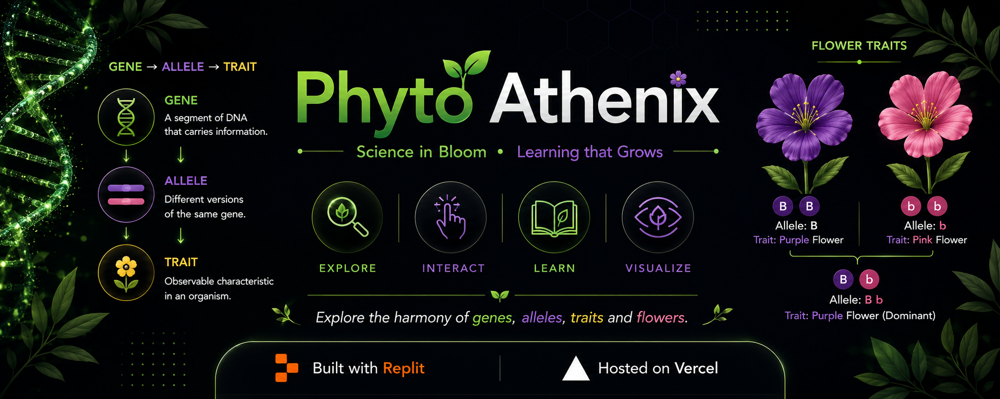

  

🧬 Phyto Athenix

Interactive DNA, Gene & Trait Simulator

A web-based educational simulator for exploring DNA, genes, chromosomes, and their relationship to observable traits through interactive scientific visualizations.

---

✨ Features

* Interactive Genetics: Explore DNA, genes, chromosomes, and traits.
* Scientific Visualization: Interactive representations of genetic concepts.
* Educational Focus: Aligned with core Biology concepts and scientific accuracy.
* Responsive Design: Optimized for desktop, tablet, and mobile devices.

---

🌱 Learning Objectives

* Understand the relationship between DNA, genes, and chromosomes.
* Explore how genes contribute to observable traits.
* Visualize the organization and transmission of genetic information.
* Strengthen conceptual understanding of genetics.

---

🚀 Build & Hosting

* Repository: GitHub
* Hosting: Vercel
* Frontend: React, TypeScript, HTML & CSS

---

🛠️ Credits & Acknowledgments

* Replit : Development environment and implementation support.
* OpenAI : Scientific validation, debugging, visualization, and code refinement.
* Anthropic (Claude) : Code review, debugging, and development support.
* Vercel : Deployment and hosting.
* GitHub : Version control and source repository.

---

👤 Author

Draven Ashcroft

* M.Sc. Ag. Entomology
* ASRB NET
* DIPS Chain of Institutions

---

📜 License

GPL-3.0
